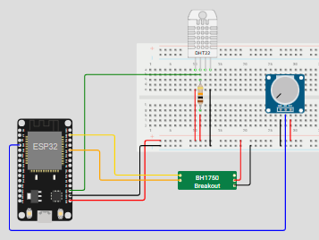

# 🌱 Hardware: Módulo de Monitoramento IoT

Este repositório contém o código e as especificações técnicas para o módulo de monitoramento botânico baseado em **ESP32**. O sistema realiza a leitura de variáveis ambientais e as transmite para o backend via API.

## 📋 Arquitetura do Sistema

O ecossistema foi projetado para operar de forma otimizada utilizando ciclos de **Deep Sleep (Modo Sonequinha)** a cada **10 minutos (600 segundos)**. Para maximizar a vida útil da bateria, o circuito utiliza um pino de controle de energia dedicado (`GPIO 32`), cortando a alimentação dos sensores por completo antes do módulo entrar em modo de repouso.

* **Sensor de Umidade de Solo:** monitoramento via leitura analógica.
* **DHT11:** monitoramento de temperatura e umidade do ar.
* **BH1750:** monitoramento de luminosidade (Lux) via protocolo I2C.

### Ciclo de Funcionamento:
1. **Acordar:** O ESP32 inicializa e ativa o barramento de energia dos sensores (`PIN_POWER_SENSORES` em `HIGH`).
2. **Leitura:** Coleta de dados físicos dos sensores ambientais (Solo, Clima e Luz).
3. **Conexão:** Ativação do chip Wi-Fi e conexão automática ou abertura do portal cativo.
4. **Transmissão:** Empacotamento dos dados em JSON e envio via requisição HTTP `POST`.
5. **Dormir:** Desconexão segura do Wi-Fi, corte de energia dos sensores (`LOW`) e entrada em Deep Sleep.

## 🔌 Pinagem (Conexões)

| Componente | Pino Componente | Pino ESP32 |
| --- | --- | --- |
| **Controle de Energia** | - | GPIO 32 |
| **Umidade Solo** | VCC | GPIO 32 |
|  | GND | GND |
|  | AO (Analog Out) | GPIO 34 |
| **DHT11** | VCC | GPIO 32 |
|  | GND | GND |
|  | DATA (Out) | GPIO 4 |
| **BH1750** | VCC | GPIO 32 |
|  | GND | GND |
|  | SCL | GPIO 22 |
|  | SDA | GPIO 21 |

> **Nota:** Todos os pinos VCC dos sensores devem ser alimentados a partir do pino de controle de energia (GPIO 32) para que o corte de corrente funcione durante o Deep Sleep.

## ⚡ Esquema Elétrico



## 📦 Dependências (Bibliotecas)
Para compilar o código do projeto, certifique-se de instalar as seguintes bibliotecas no seu ambiente de desenvolvimento:

* **Wire.h:** Biblioteca nativa para comunicação I2C.
* **BH1750:** Comunicação e leitura em Lux do sensor de luminosidade (por Christopher Laws).
* **DHT sensor library:** Leitura simplificada dos sensores DHT11/DHT22.
* **ArduinoJson:** Serialização e desserialização de objetos JSON para envio via API.
* **WiFiManager:** Gerenciamento dinâmico de credenciais Wi-Fi (portal cativo), evitando codificar a senha da rede diretamente no firmware.
* **WiFi.h & HTTPClient.h:** Bibliotecas nativas do ecossistema ESP32 para gerenciamento de rede e requisições HTTP.

## 🔄 Fluxo de Integração e Payload da API

O ESP32 processa os dados antes do envio para a API:

1. **Tratamento da Umidade do Solo:**
   * **Escala Interna (IA):** Conversão da leitura analógica original (0-4095) para a escala de 10 bits (0-1023).
   * **Escala Percentual:** Inversão lógica e mapeamento para escala amigável ao usuário final (4095 correspondendo a `0% - Seco` e 0 correspondendo a `100% - Molhado`).
2. **Gerenciamento de Rede (WiFiManager):**
   * Caso não haja redes conhecidas salvas, o dispositivo cria um ponto de acesso (AP) com as seguintes credenciais para configuração manual:
     * **SSID:** `Lumees_Yapp_Setup`
     * **Senha:** `lumees024`
   * Possui um *timeout* de segurança configurado para **100 segundos** para evitar consumo excessivo de energia caso falhe em conectar.
3. **Autenticação:** O endereço `MAC Address` do hardware é capturado em tempo de execução e serve como identificador único na API.

### Modelo de Payload (JSON)
Os dados são transmitidos via método `POST` para a URL de produção:
`https://lumees-yapplant.onrender.com/lumees-api/v1/hardware/coleta`

```json
{
  "mac_hardware": "AA:BB:CC:DD:EE:FF",
  "umidade_solo_bruto": 412.0,
  "umidade_solo_porcentagem": 65.0,
  "luminosidade": 350.0,
  "temperatura_ar": 24.5,
  "umidade_ar": 58.0
}
```

> **Nota:** O backend recebe o JSON estruturado acima, valida os campos e realiza a persistência e atualização no Firebase Firestore, mantendo as informações sincronizadas instantaneamente com a aplicação mobile.